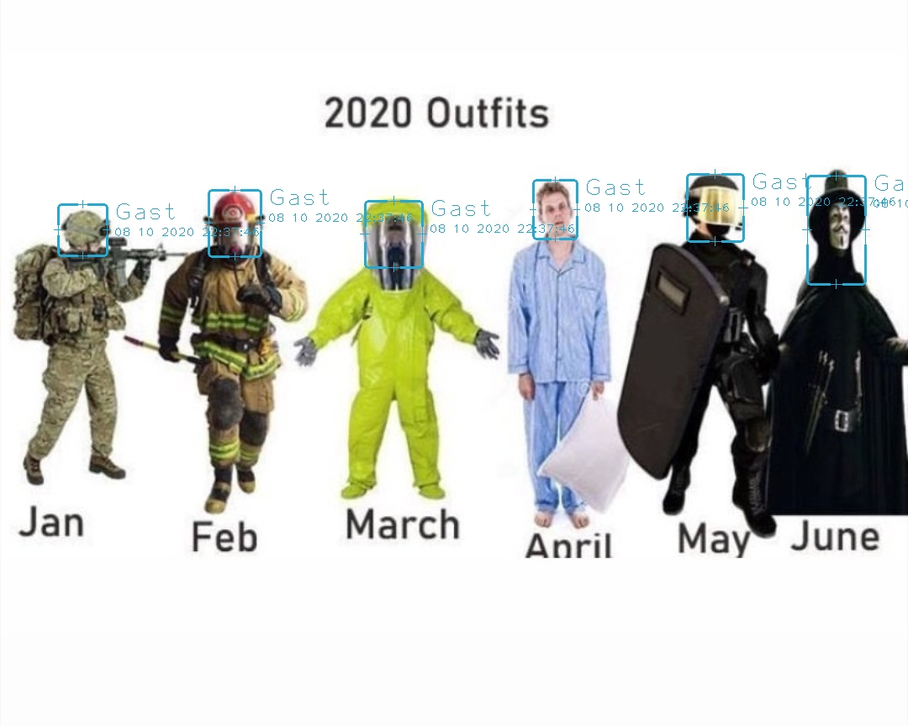

# SpaiEye3D

This is an old project for facerecognition using YOLOv3. I started converting it to C++ but never finished it.

This project can be used for home surveilance and does support remote monitoring. Support to remotely control 2 axis cameras is not integrated.

# Warning

    The project is old and I just tested a small video. it is highly possible that some changes are needed to run other function like websupport. 

# Get it running on Debian

    Note: I don't have any graphicscard right now and did not test any cuda stuff. Maybe it needs a dedicated cuda installation, maybe not.
    On my test setup without graphiccard is runs in CPU mode. Very slow.

This will create a virtual environment for the python modules.
The path can be anything.
In this example the path will be: /path/to/python-venv

# INFO: The trained YOLOv3 weight file is too big to upload it into this repo directly. 

Please download the weight file from the google drive and place it into the "/data/weights/" folder:

https://drive.google.com/file/d/1HEKrZdoKdalW7xumZKqNN2QTTYEyhvlV/view?usp=drive_link

It is also possible to use the default YOLOv3 weights file. To do so uncomment this line in the main.py file:

            #self.detector = YOLOv3(cfg.YOLOV3.CFG, cfg.YOLOV3.WEIGHT, cfg.YOLOV3.CLASS_NAMES, score_thresh=cfg.YOLOV3.SCORE_THRESH, nms_thresh=cfg.YOLOV3.NMS_THRESH, is_xywh=True, use_cuda=self.cuda_enabled)

and then comment out this line:

            self.detector = YOLOv3(cfg.YOLOV3HEAD.CFG, cfg.YOLOV3HEAD.WEIGHT, cfg.YOLOV3HEAD.CLASS_NAMES, score_thresh=cfg.YOLOV3HEAD.SCORE_THRESH, nms_thresh=cfg.YOLOV3HEAD.NMS_THRESH, is_xywh=True, use_cuda=self.cuda_enabled)

The code is built to use a single YOLO class. If the default YOLO weight file is used, which is a multiobject file, the desired class/objecttype needs to be selected somewehere in the code too. Need to look it up.

# Create virtual python environment first

    python3 -m venv /path/to/python-venv
    
# Activate the environment

    cd /path/to/python-venv/bin
    source activate
    
# Install requirements into the active environment

    pip3 install opencv-python
    pip3 install natsort
    pip3 install torch
    pip3 install pillow
    pip3 install torchvision
    pip3 install scipy
    pip3 install pyyaml
    pip3 install easydict
    pip3 install PyQt5
    pip3 install backports.lzma
    
    
    
If there are problems with "module lzma not found":

    Open the file:
        /path/to/python-venv/lib/python3.10/site-packages/torchvision/datasets/utils.py
        
        
    Change line 4 (could be a different line) from:
        import lzma
    to:
        import backports.lzma as lzma
        
        
        
Done. Run a test with an image or videofile:

# Switch to the main SpaiEye3D folder

    cd /path/to/SpaiEye3D-main
    python3 main.py --file /path/to/yourvideo.mp4 --writeout
    
It will show the video and store the resulting frames in the output directory for videos (/output/video)

The language within the project is german and there are no other languages available yet. But it is easy to translate everything by changing the file "/language_pack/language.py"

What needs to be done:

 - Better documentation
 - In IP Cam Mode the socket connection is not encrypted
 - Also in IP Cam Mode, if the stream_client connects to the processing server it only uses a simple key to authenticate. It should create a dynamic key or use a custom fixed key. For now just change the key in main.py and stream_client.py.
 - Add control for stepper motors/servos to move/rotate the cam
 - DeepSort is deactivated because it does not produce the wanted results. But we need some modified parts of the code so it's added here.
 - Add infrared cam stuff  

# About the weight file
 - It's a single class YoloV3 Weightfile, trained to detect heads. 
 - Trained for only ~50k rounds with ~30k Images. I still have 100k Images that will join the dataset after labeling.
 - The set uses many custom images and some ready-to-use datasets.
 - In some cases the model is very good. In some others not so. Find out yourself. But after adding the other 100k images an let it train 500k round it should do exceptenially well.
 
 
 To use this App download the weightfile "yolov3-single-class-512_last.weights" and place it in the folder:
     ./data/weights

https://drive.google.com/file/d/1HEKrZdoKdalW7xumZKqNN2QTTYEyhvlV/view?usp=drive_link

# Usage:

- If we only want a video_stream with no further processing:  

         python3 main.py --stream_only  

- Simply tag objects on an image:

         python3 main.py --file '/path/file.jpg' [image or video]  

- IP-Cam Mode [stream images from webcam to server]  

     On the PC with the cam
     
         python3 stream_client.py --remote_config "/url/to/a/config.json"
         
         ( without the remote config file it will use default config for localhost. You can change this in the code to whatever ip you want. )
         
         The json file is a simple JSON object only containing server_ip and server_port:
         {
           server_ip: 0.0.0.0,
           server_port: 1338
         }
         
     On the PC we use for controling and processing the stream
     
         python3 main.py --remote  

- It is possible to create a video of the full webcamstream. Use:

        python3 main.py --writeout  

- Monitor mode  

    To use this app in monitormode just add:
    
        python3 main.py --monitor
    
    In monitor mode every motion will be detected and saved to a video file. Basic motion based surveillance camera.  

- We can use this app to extract frames from videofiles (not the whole video just every nth frame)  

    At the moment the default setting is every 50th frame.
    This can be changed at "self.extraction_number = 50"

    Those frames can then be used for training purposes.
    To do so, just use a command like this:

        python3 main.py --file '/path/to/videofile' --extract  

- Label folders with images  

    For training we need images with labelfiles.
    To speed up the process we can run this app over a full folder with images.
    It will grab each image an create a labelfile with the matches.
    The result still needs to get verified by hand, but it really speeds up the work.
 
    Use this command to label a full folder:

       python3 main.py --dir '/path/to/imagefolder'
    
    The resulting labels will be stored at ./output/labels_tmp/  

- Output files will be saved under ./output/specific_folder  

    (monitor mode) If we are in monitor mode the videos from movements are stored in ./output/monitor
    (frame extraction mode) If we axtract frames from videos, the frames are stored in ./output/frames
    (tag images) If we simple tag matches in an image the tagged file is stored under ./output/images
    (tag video) If we simple tag matches in a videofile the result is stored under ./output/videos
    (label dir) The resulting labels will be stored at ./output/labels_tmp/

If no Cuda is installed the app will switch to really slow CPU processing
It is possible to force cpu usage for whatever reason. Just add --cpu to the command

One of the real good examples:

